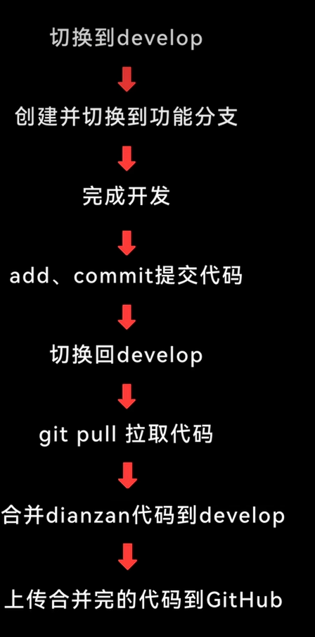

# git进阶笔记

## 创建分支

```git
$ git branch 
```

> 查看分支

```git
$ git checkout -b develop
```

> 创建分支develop

```git
$ git add *
```

```git
$ git commit -m-"note"
```

```git
$ git  checkout main
```

> 回到main分支

```git
$ git merge develop
```

> 合并代码

```git
$ git push origin main
```

> 上传完成

****

## 团队合作工作流 


