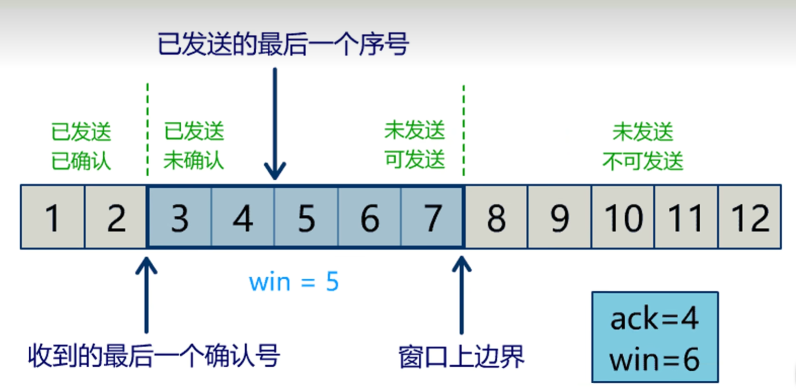
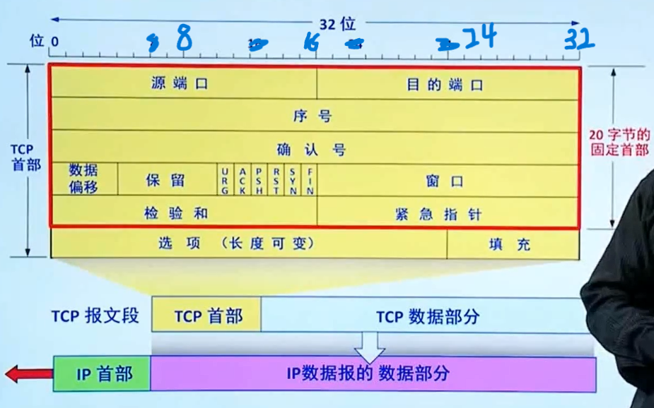
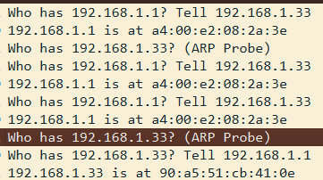

# network 学习笔记

****

# 网络

电脑发送包

> 电脑内有arp表[^arp]
> 
> (源mac 目标mac)

> (源ip 目标ip)

|
|

↓

交换机

> 记录发送和接收的信息创建mac地址表

> (有mac地址表)[^mac地址]记录mac地址和端口对应
> 
> 将源IP和目标ip不在同一个子网[^子网]的包交给默认网关(一般为路由器)

|

|

↓

*电脑*  或  

路由器

> 内有arp表

> 记录ip地址表
> 
> 可以修改包的目标mac地址

|

|

↓

交换器

|

|

↓

电脑

* 电脑
  
  > 1.需要知道源ip和目标ip
  > 2.通过子网掩码判断是否在同一个子网
  > 3.在同一子网通过arp获得mac地址发送
  > 4.不在同一子网就通过arp获得默认网关的mac地址发送

* 交换机

> 1,需要知道目标mac地址
> 
> 2.通过mac地址表查映射关系
> 
> 3.查到就从指定端口发送
> 
> 4.查不到就从所有端口发送出去

* 路由器

> 1.需要知道ip地址
> 
> 2.通过路由表查映射关系
> 
> 3.查到了就发送指定端口
> 
> 4.查不到就返回一个路由不可达的数据包

*网络层(ip协议)本身没有传输包的功能,包的实际传输是委托给数据链路层,也就是以太网中的交换机来实现的*

****

## TCP(传输层)

*面向连接的,可靠的,基于字节流动的传输层通信协议*

**端口号**

> 包的传输层头部,满足进程和进程之间的通信

**停止等待交付（可靠交付）**

> 发送包后接收一个 目标 发送的ack[^ack]确认交付
> 
> *累计确认*:发送连续成功接收的seq＋1即可判断前面的包全部成功接收

**流量控制**

> 返回的包含win值确认接收方的最大处理能力
> 
> *滑动窗口：*

> 网络环境决定拥塞窗口,窗口大小取拥塞窗口和滑动窗口的最小值

**三次握手**

> 发送方发送SYN
> 
> 接收方收到后回复ACK和一个SYN
> 
> 发送方接收到后回复一个ACK

## 报文结构

## TCP 释放连接

> 四次握手

****

## HTTP

一种协议:超文本传输协议

客户端，服务端

### 报文结构

### 请求报文

起始行

> GET /index.html HTTP/1.1
> 
> *方法 URL HTTP 版本*

请求头（一行一个）

> Host: www.xxx.com
> 
> User-Agent: browser
> 
> Content-Type: application/json
> 
> ...

空行（必须有）

消息体（可选）

### 响应报文

起始行

> HTTP/1.1 200 OK

响应头（一行一个）

> Content-Type: text/html
> 
> Content-Length: 1024
> 
> Server: Nginx
> 
> ...

空行（必须有）

消息体（可选）

> 网页内容、JSON、图片等

## HTTP 状态码的含义

### 1xx 信息性状态码（Informational）

表示请求已接收，服务端正在处理，属于**临时响应**。

* **100 Continue**：客户端可继续发送请求体
* **101 Switching Protocols**：协议切换（如升级到 WebSocket）

### 2xx 成功状态码（Success）

表示请求已被**成功接收、理解并处理**。

* **200 OK**：请求处理成功，正常返回资源
* **201 Created**：请求已完成，新资源已创建
* **204 No Content**：请求成功，但无响应体返回
* **206 Partial Content**：部分内容响应（断点续传）

### 3xx 重定向状态码（Redirection）

表示客户端需要**进一步操作**才能完成请求，通常用于地址跳转。

* **301 Moved Permanently**：资源永久迁移
* **302 Found / 307 Temporary Redirect**：临时重定向
* **304 Not Modified**：资源未修改，使用本地缓存（协商缓存）

### 4xx 客户端错误（Client Error）

表示**请求本身存在错误**，服务端无法处理。

* **400 Bad Request**：请求报文格式错误
* **401 Unauthorized**：未认证，需要身份验证
* **403 Forbidden**：服务端拒绝访问，权限不足
* **404 Not Found**：请求资源不存在
* **405 Method Not Allowed**：请求方法不被支持
* **429 Too Many Requests**：请求频率超限

### 5xx 服务端错误（Server Error）

表示服务端处理合法请求时**出现异常**。

* **500 Internal Server Error**：服务端内部未知错误
* **502 Bad Gateway**：网关 / 代理收到无效响应
* **503 Service Unavailable**：服务暂不可用（过载 / 维护）
* **504 Gateway Timeout**：网关超时

****

## 网络通信分析

ARP协议：电脑和路由器互相获取ip地址和MAC地址

****

[^mac地址]:
    * 出厂固定
    * 前 6 位：**厂商编号**（比如华为、苹果、Intel 都有固定段）
    * 后 6 位：**设备序列号**

[^子网]:
    源ip 与 目的ip同时和子网掩码进行与运算
    
    相等则在同一子网

[^arp]:
    arp协议
    
    电脑经过arp请求制定arp表 将mac地址和ip地址对应

[^ack]:
    * **全称**：确认号（Acknowledgment Number）
    * **位置**：TCP 报文头部，占**4 字节（32 位）**
    * **计算规则**：`ACK号 = 已成功接收的最后一个连续字节的序号(seq) + 1`
    * **生效条件**：只有当 TCP 头部的**ACK 标志位（Flag）设为 1**时，该字段的值才有效。
